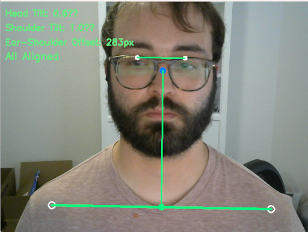
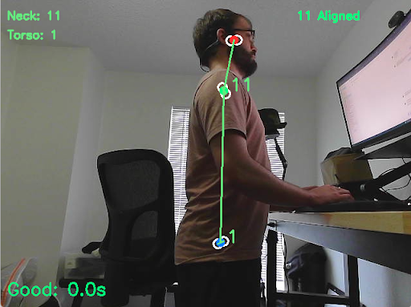
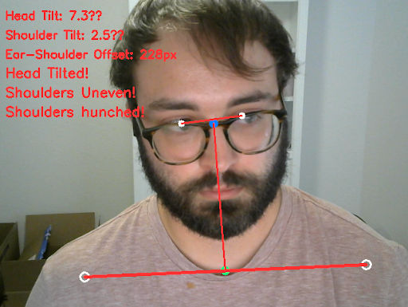
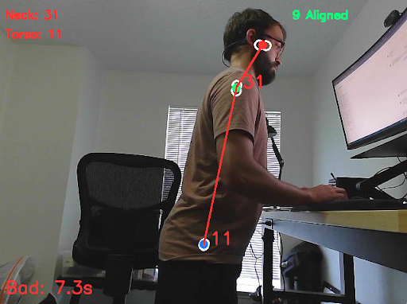

# Dual Camera Posture Monitor

## Good posture examples:



## Bad posture examples:



## Overview
This project uses two webcams to monitor your posture in real time. It can also be used with one side facing webcam using the --single-camera flag. The code was adapted from https://github.com/mecantronic/posture-monitor

A terminal alert will be played if posture is poor for more than a given amount of time.

Factors measured for posture are the tilt of the head, shoulders, neck, and torso. Also the front to back offset of the shoulders, and the vertical offset of the shoulders from the head are measured.

The threshold values are all set to defaults based on me and my webcam setup. To figure out the proper values for you, run the program and observe the values displayed on screen when you have good posture. Set the threshold values near your observed values.


## Requirements
* Python 3.x
* OpenCV (`pip install opencv-python`)
* NumPy (`pip install numpy`)
* Mediapipe (`pip install mediapipe`)
* Explicit requirements defined in requirements.txt

## Usage
1. Clone the repository to your local machine
``` bash
git clone https://github.com/DonMaEn/posture-monitor.git
```

2. Navigate to the project directory
``` bash
cd posture-monitor
```

3. Create and activate a virtual environment:
``` bash
python -m venv venv
```
* On Windows:
    ``` bash
    venv\Scripts\activate
    ```
* On macOS and Linux:
    ``` bash
    source venv/bin/activate
    ```

4. Install the required dependencies:
``` bash
pip install -r requirements.txt
```

5. Run the posture monitoring script:
``` bash
python app.py 
```

6. NOTE: you have to press q while in one of the live webcam windows to close the program.

7. If you would like to change parameters, run the script with the help option for more information:
``` bash
python app.py --help
```

## Acknowledgments
This project utilizes the [MediaPipe](https://mediapipe.dev/) library for pose estimation.

## License
This project is licensed under the [MIT License](https://opensource.org/license/mit/).
